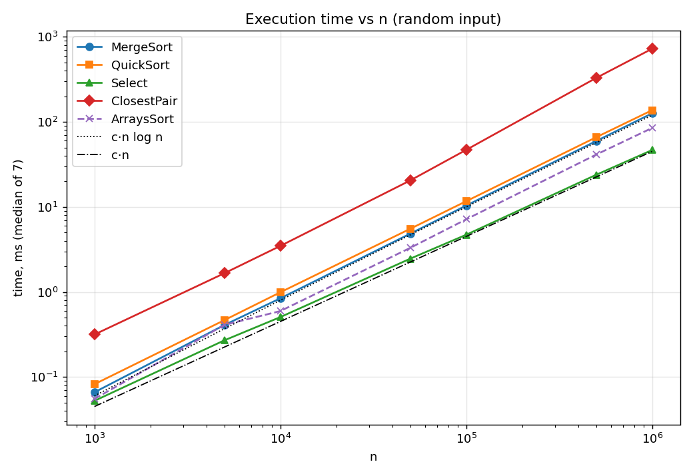
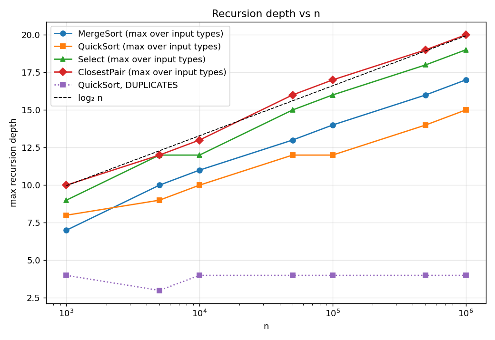
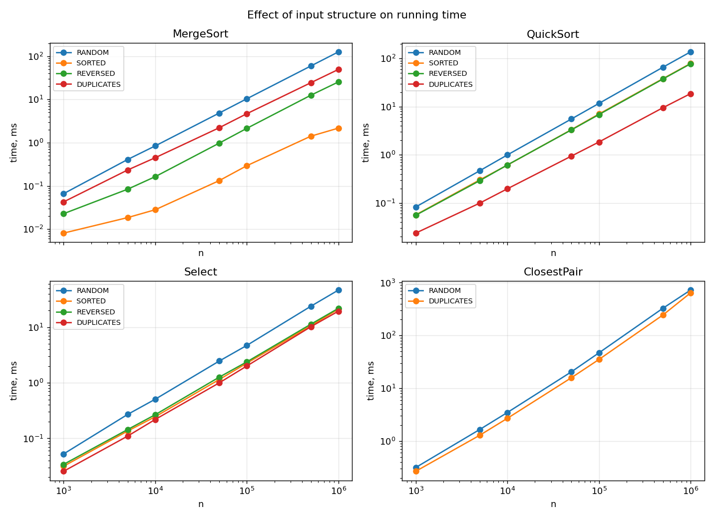
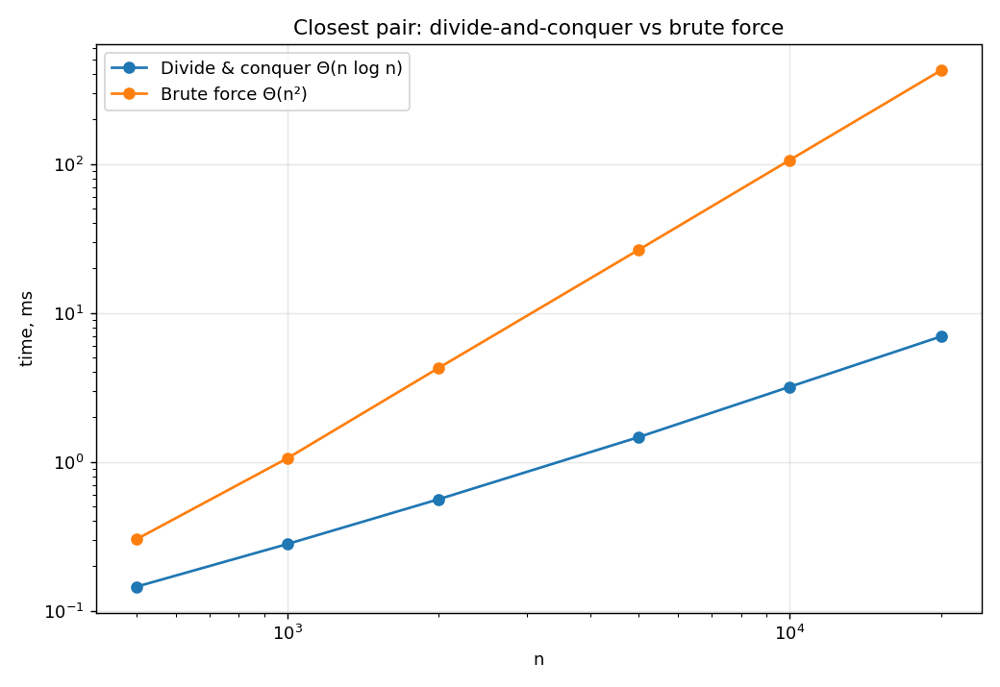
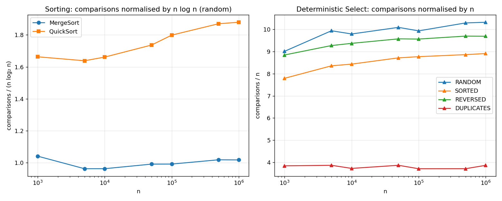
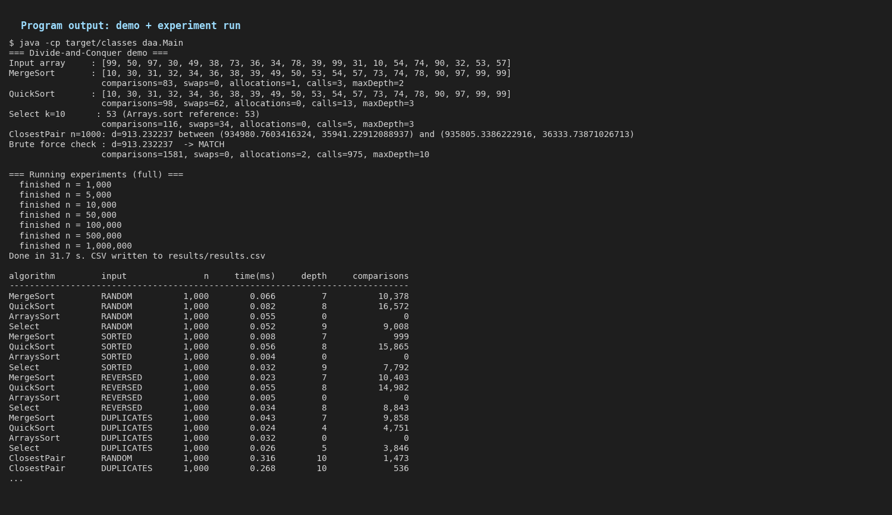
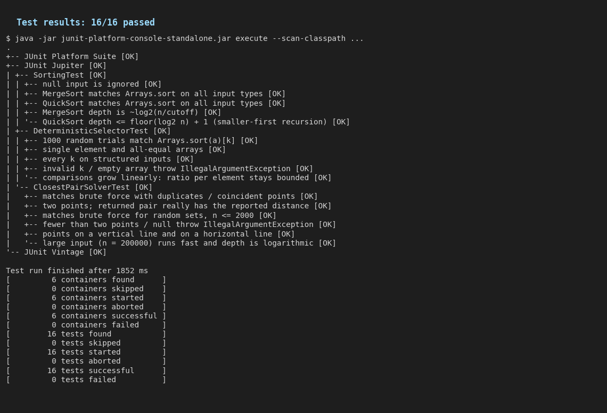
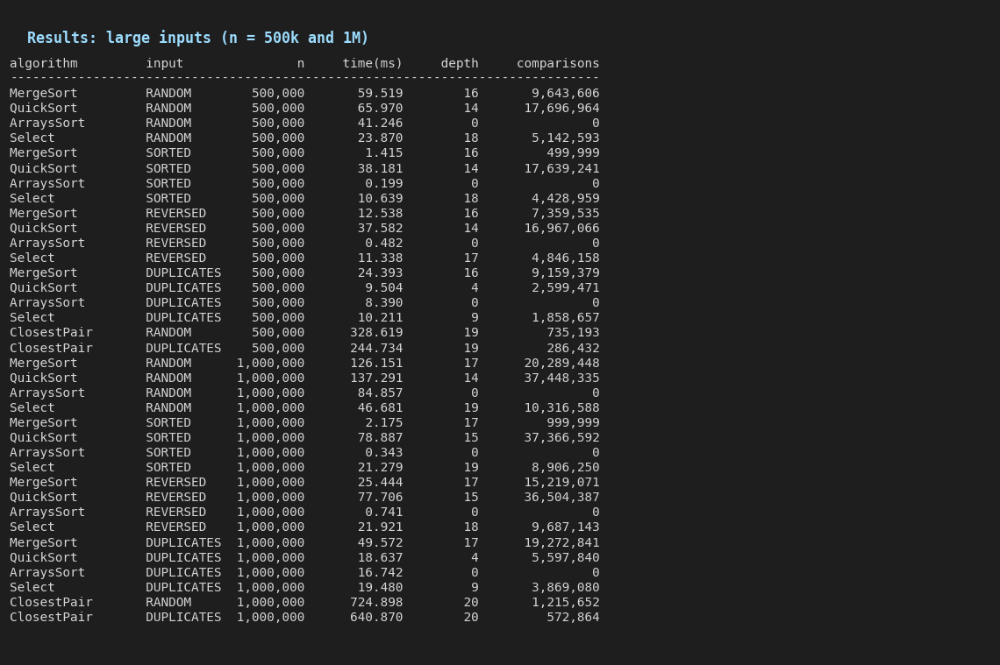
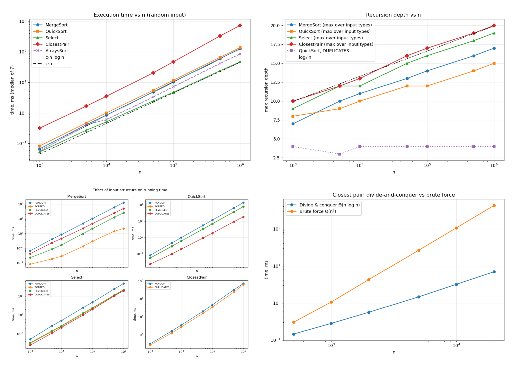

# Assignment 1 — Divide-and-Conquer Algorithm Analysis

Java 17 implementation and experimental study of four classic divide-and-conquer
algorithms: **MergeSort**, **randomized QuickSort**, **Deterministic Select
(Median-of-Medians)** and **Closest Pair of Points**.

---

## Contents

- [A. Project overview](#a-project-overview)
- [B. Algorithm analysis](#b-algorithm-analysis)
- [C. Experimental results](#c-experimental-results)
- [D. Discussion](#d-discussion)
- [E. Reflection](#e-reflection)
- [F. Screenshots](#f-screenshots)
- [How to build and run](#how-to-build-and-run)

---

## A. Project overview

**Purpose.** The goal of the assignment is to implement classic divide-and-conquer
algorithms, derive their running-time recurrences (Master Theorem / Akra–Bazzi), and then
check the theory against measurements of execution time, recursion depth and operation
counts on inputs of different sizes and structures.

**Implemented algorithms**

| Algorithm | Class | Key techniques | Complexity |
|---|---|---|---|
| MergeSort | `MergeSorter` | linear merge, one reusable buffer, insertion-sort cut-off (n ≤ 16), skip merge if halves already ordered | Θ(n log n) |
| QuickSort | `QuickSorter` | random pivot, in-place 3-way partition, recurse on smaller part / loop on larger | Θ(n log n) expected, O(n²) worst, depth ≤ ⌊log₂n⌋+1 |
| Deterministic Select | `DeterministicSelector` | groups of 5, median-of-medians pivot, in-place 3-way partition, recurse into one side only | Θ(n) worst case |
| Closest Pair | `ClosestPairSolver` | presort by x, recursive split, y-order kept by merging, strip scan with ≤ 7 neighbours | Θ(n log n) |

**Project structure**

```
assignment1-divide-and-conquer/
├── src/daa/
│   ├── MergeSorter.java
│   ├── QuickSorter.java
│   ├── DeterministicSelector.java
│   ├── ClosestPairSolver.java
│   ├── Point.java
│   ├── Metrics.java          # counters: comparisons, swaps, allocations, calls, max depth
│   ├── Experiment.java       # benchmark harness + CSV writer
│   └── Main.java             # demo + experiments
├── tests/daa/                # JUnit 5 tests
├── scripts/                  # plot_results.py, render_screenshots.py
├── docs/plots/               # generated plots
├── docs/screenshots/
├── results/results.csv       # raw experimental data
├── README.md
├── pom.xml
└── .gitignore
```

**Metrics collected** (class `Metrics`, one instance per run):

- *execution time* — `System.nanoTime()`, median of 7 runs after a JIT warm-up;
- *maximum recursion depth* — `enter()`/`exit()` in every recursive method (exit in `finally`);
- *comparisons* between keys (additional metric), *swaps*, *allocations* of auxiliary arrays,
  *number of recursive calls*.

---

## B. Algorithm analysis

### 1. MergeSort

**How it works.** Split `a[lo, hi)` at the middle, sort both halves recursively and merge
them in linear time. Implementation details:

- **Reusable buffer.** One `int[n]` buffer is allocated in `sort()` and passed down; merges
  never allocate (the `allocations` metric is always 1). Only the left half is copied into the
  buffer; the right half is read in place, so each merge does ≤ `hi − lo` writes.
- **Cut-off.** Sub-arrays of size ≤ 16 are sorted by insertion sort, which is faster than
  recursion for tiny ranges (fewer calls, better cache behaviour).
- **Already-ordered check.** If `a[mid−1] ≤ a[mid]` the merge is skipped. This costs one
  comparison and makes sorted input almost linear.
- The merge uses `≤`, so the sort is **stable**.

**Recurrence.** T(n) = 2T(n/2) + Θ(n).
Master Theorem: a = 2, b = 2, n^(log_b a) = n, f(n) = Θ(n) → **case 2** →
**T(n) = Θ(n log n)**. The cut-off only changes the leaves: n/16 leaves × O(16²) = Θ(n),
so the total stays Θ(n log n) and the recursion depth drops to ⌈log₂(n/16)⌉ + 1.

**Space.** Θ(n) buffer + Θ(log n) stack. **Best case** (sorted, thanks to the ordered
check): Θ(n) comparisons — confirmed by exactly n − 1 comparisons in the results.

### 2. QuickSort (randomized)

**How it works.** Choose a uniformly random pivot, partition in place with Dijkstra's
3-way scheme into `< pivot | == pivot | > pivot`, then:

```java
if (leftSize < rightSize) { sort(a, lo, lt - 1); lo = gt + 1; }   // recurse smaller
else                      { sort(a, gt + 1, hi); hi = lt - 1; }   // loop over larger
```

Keys equal to the pivot are final and never touched again, which is why duplicate-heavy
input is very fast.

**Recurrence.** For a random pivot of rank k:
T(n) = T(k) + T(n − 1 − k) + Θ(n), with k uniform on {0, …, n−1}.
Taking expectation, E[T(n)] = (2/n)·Σ E[T(k)] + Θ(n), whose solution is
**E[T(n)] = Θ(n log n)** (≈ 2n ln n ≈ 1.39 n log₂ n key comparisons for the 2-way variant).

*Akra–Bazzi intuition:* a "typical" pivot splits αn / (1−α)n with α ∈ [1/4, 3/4] half of the
time. For T(n) = T(αn) + T((1−α)n) + n the exponent p satisfies α^p + (1−α)^p = 1 ⇒ p = 1,
and T(n) = Θ(n(1 + ∫ u/u² du)) = Θ(n log n) — the same order for every constant split.

*Worst case:* if the pivot is always the minimum/maximum, T(n) = T(n−1) + Θ(n) = **Θ(n²)**.
With a random pivot the probability of this is astronomically small and does not depend on
the input order (sorted and reversed inputs are as fast as random).

**Space / depth.** Because we recurse only into the smaller part, every recursive call gets
at most half of the current range, so the stack depth is **≤ ⌊log₂ n⌋ + 1 even in the worst
case**; the larger part is handled by the loop (manual tail-call elimination).

### 3. Deterministic Select (Median-of-Medians, BFPRT)

**How it works** (`select(a, k)` returns the k-th smallest, 0-based, permuting `a` in place):

1. If the range has fewer than 5 elements — insertion sort and return `a[k]`.
2. Split into groups of 5, insertion-sort each group, swap each group median to the front
   of the range.
3. Recursively select the median of these ⌈n/5⌉ medians → pivot value *x*.
4. In-place 3-way partition around *x*.
5. If `k` is in the left part recurse left, if in the right part recurse right, otherwise
   the answer is *x* — **only one side is ever visited**.

**Why the pivot is good.** At least half of the ⌈n/5⌉ groups have a median ≤ x, and each such
group contributes 3 elements ≤ x, so ≥ 3n/10 − 6 elements are ≤ x; symmetrically for ≥ x.
Hence the recursive call gets at most **7n/10 + 6** elements.

**Recurrence.** T(n) ≤ T(⌈n/5⌉) + T(7n/10 + 6) + Θ(n).

The Master Theorem does not apply (two sub-problems of different sizes). With
**Akra–Bazzi**: find p with (1/5)^p + (7/10)^p = 1. For p = 1 the sum is 0.9 < 1, so p < 1
(p ≈ 0.84). Then T(n) = Θ(n^p (1 + ∫₁ⁿ u / u^(p+1) du)) = Θ(n^p · n^(1−p)) = **Θ(n)**.
*Intuition:* the total work per level shrinks geometrically — n + 0.9n + 0.81n + … ≤ 10n.

**Space.** In place; recursion depth O(log n).

### 4. Closest Pair of Points

**How it works.**

1. Copy the input and sort it **by x once** (Θ(n log n)).
2. `solve(lo, hi)`: for ≤ 3 points use brute force; otherwise remember the dividing line
   `midX = x[mid]`, solve both halves → δ = min(δ_L, δ_R).
3. Each call leaves its range **sorted by y** — the two y-sorted halves are merged like in
   MergeSort (Θ(n)), so no re-sorting is needed at any level.
4. **Strip:** collect points with |x − midX| < δ (already in y-order) and compare each with
   the following points only while Δy < δ. A packing argument shows at most 7 such points
   can exist (a δ × 2δ rectangle holds ≤ 8 points pairwise ≥ δ apart).

**Recurrence.** T(n) = 2T(n/2) + Θ(n) (merge + strip) → Master Theorem **case 2** →
**Θ(n log n)**, plus the initial Θ(n log n) sort. (The naive version that re-sorts the strip by
y at every level gives T(n) = 2T(n/2) + Θ(n log n) = Θ(n log² n).)

**Space.** Θ(n) for the x-sorted copy and the auxiliary array; depth ≈ log₂(n/3).

### Summary

| Algorithm | Recurrence | Method | Time | Extra space |
|---|---|---|---|---|
| MergeSort | 2T(n/2)+Θ(n) | Master, case 2 | Θ(n log n) | Θ(n) |
| QuickSort | T(k)+T(n−k−1)+Θ(n) | expectation / Akra–Bazzi | Θ(n log n) exp., O(n²) worst | O(log n) |
| Select | T(n/5)+T(7n/10)+Θ(n) | Akra–Bazzi, p≈0.84<1 | Θ(n) worst | O(log n) |
| Closest Pair | 2T(n/2)+Θ(n) | Master, case 2 | Θ(n log n) | Θ(n) |

---

## C. Experimental results

**Setup.** OpenJDK 21, Intel Xeon @ 2.10 GHz (1 vCPU), max heap 1 GB, Serial GC.
Sizes: 1 000, 5 000, 10 000 (*small*), 50 000, 100 000 (*medium*), 500 000, 1 000 000 (*large*).
Input types: random, sorted, reversed, duplicate-heavy (values in [0, 10)). For Closest Pair:
random points in [0, 10⁶)² and a "duplicates" set on a small integer grid (many coincident
points). Every configuration: 60-iteration JIT warm-up, then 7 runs on a fresh copy of the
same input, **median** time reported, `System.gc()` before each timed run (outside the timer).
`Arrays.sort()` (JDK dual-pivot quicksort) is included as a baseline.

Raw data: [`results/results.csv`](results/results.csv)
(columns: `algorithm, input_type, size_class, n, time_ms, max_depth, comparisons, swaps, allocations, recursive_calls`).

### Execution time

**MergeSort** — time, ms

| n | random | sorted | reversed | duplicates |
|---:|---:|---:|---:|---:|
| 1,000 | 0.066 | 0.008 | 0.023 | 0.043 |
| 10,000 | 0.843 | 0.028 | 0.164 | 0.449 |
| 100,000 | 10.379 | 0.293 | 2.147 | 4.683 |
| 1,000,000 | 126.2 | 2.175 | 25.444 | 49.572 |

**QuickSort** — time, ms

| n | random | sorted | reversed | duplicates |
|---:|---:|---:|---:|---:|
| 1,000 | 0.082 | 0.056 | 0.056 | 0.024 |
| 10,000 | 0.992 | 0.610 | 0.614 | 0.197 |
| 100,000 | 11.684 | 7.033 | 6.856 | 1.843 |
| 1,000,000 | 137.3 | 78.887 | 77.706 | 18.637 |

**Select** — time, ms

| n | random | sorted | reversed | duplicates |
|---:|---:|---:|---:|---:|
| 1,000 | 0.052 | 0.032 | 0.034 | 0.026 |
| 10,000 | 0.507 | 0.245 | 0.267 | 0.219 |
| 100,000 | 4.712 | 2.256 | 2.383 | 2.008 |
| 1,000,000 | 46.681 | 21.279 | 21.921 | 19.480 |

**ArraysSort** — time, ms

| n | random | sorted | reversed | duplicates |
|---:|---:|---:|---:|---:|
| 1,000 | 0.055 | 0.004 | 0.005 | 0.032 |
| 10,000 | 0.597 | 0.007 | 0.011 | 0.162 |
| 100,000 | 7.155 | 0.033 | 0.086 | 1.495 |
| 1,000,000 | 84.857 | 0.343 | 0.741 | 16.742 |

**ClosestPair** — time, ms

| n | random | duplicates |
|---:|---:|---:|
| 1,000 | 0.316 | 0.268 |
| 10,000 | 3.481 | 2.701 |
| 100,000 | 46.917 | 35.149 |
| 1,000,000 | 724.9 | 640.9 |


### Recursion depth

Maximum depth over all input types:

| n | ⌈log₂ n⌉ | MergeSort | QuickSort | Select | ClosestPair | QuickSort (duplicates) |
|---:|---:|---:|---:|---:|---:|---:|
| 1,000 | 10 | 7 | 8 | 9 | 10 | 4 |
| 5,000 | 13 | 10 | 9 | 12 | 12 | 3 |
| 10,000 | 14 | 11 | 10 | 12 | 13 | 4 |
| 50,000 | 16 | 13 | 12 | 15 | 16 | 4 |
| 100,000 | 17 | 14 | 12 | 16 | 17 | 4 |
| 500,000 | 19 | 16 | 14 | 18 | 19 | 4 |
| 1,000,000 | 20 | 17 | 15 | 19 | 20 | 4 |

### Additional metric: comparisons (random input)

| n | MergeSort cmp/(n log₂n) | QuickSort cmp/(n log₂n) | QuickSort swaps | Select cmp/n | ClosestPair distance evals + strip checks |
|---:|---:|---:|---:|---:|---:|
| 1,000 | 1.04 | 1.66 | 11,319 | 9.01 | 1,473 |
| 10,000 | 0.96 | 1.66 | 147,954 | 9.79 | 15,852 |
| 100,000 | 0.99 | 1.80 | 1,983,751 | 9.93 | 200,978 |
| 1,000,000 | 1.02 | 1.88 | 25,019,210 | 10.32 | 1,215,652 |

The normalised columns are almost constant → the operation counts grow exactly as
n log n (sorting) and n (selection).

### Closest pair: divide-and-conquer vs O(n²) brute force

| n | D&C, ms | brute force, ms | speed-up |
|---:|---:|---:|---:|
| 500 | 0.145 | 0.302 | ×2.1 |
| 1,000 | 0.281 | 1.059 | ×3.8 |
| 2,000 | 0.562 | 4.277 | ×7.6 |
| 5,000 | 1.467 | 26.513 | ×18.1 |
| 10,000 | 3.195 | 106.304 | ×33.3 |
| 20,000 | 6.951 | 424.944 | ×61.1 |

Doubling n multiplies brute force time by ≈ 4 (quadratic) but D&C time by ≈ 2.1 (n log n).

### Plots

**Time vs n** (log–log, random input; dotted/dash-dotted lines are c·n log n and c·n):



**Recursion depth vs n:**



**Effect of input type:**



**Closest pair — D&C vs brute force:**



**Comparisons normalised by the theoretical growth rate:**



---

## D. Discussion

**Do the results match the theoretical complexity?**
Yes. On the log–log plot MergeSort and QuickSort run parallel to the c·n log n line and
Select runs parallel to c·n: from 100 000 to 1 000 000 elements (×10) MergeSort goes
10.4 → 126 ms (×12.2; n log n predicts ×12), QuickSort 11.7 → 137 ms (×11.7) and Select
4.7 → 46.7 ms (×9.9; linear predicts ×10). The operation counts are even cleaner:
MergeSort makes 0.96–1.04 · n log₂ n comparisons and Select makes ≈ 9–10 · n comparisons for
every n — a constant per element, exactly what a Θ(n) bound means.
QuickSort's ratio 1.66–1.88 is higher than 1.39 because the 3-way partition spends up to two
comparisons per element; it slowly approaches its limit from below as lower-order terms
fade. Recursion depths are logarithmic for all four algorithms (a straight line on a
log-x axis). Closest Pair grows slightly faster than n log n above 10⁵ points (see the cache
discussion below), but the D&C vs brute-force comparison clearly shows n log n vs n².

**How does input structure affect performance?**
- *MergeSort:* sorted input is ~50× faster than random because every merge is skipped
  (exactly n − 1 comparisons); reversed input is ~5× faster than random because each merge
  copies the left half and then takes the whole right half first — very predictable branches.
- *QuickSort:* thanks to the random pivot, sorted and reversed input are **not** worst cases;
  they are even faster than random because partition branches are predictable. Duplicate-heavy
  input is the fastest (7× faster than random at 10⁶) because the 3-way partition removes all
  equal keys at once — with 10 distinct values the depth is only 4.
- *Select:* all input types are linear; duplicates stop early when k falls into the "equal"
  block (depth 5–9 instead of 19).
- *Closest Pair:* grid input with coincident points is a bit faster — δ quickly becomes 0 or
  very small and the strip is almost empty.
- *Arrays.sort* detects already sorted/reversed runs and handles them in Θ(n).

**Why does smaller-first recursion help QuickSort?**
Stack depth is determined by the chain of *recursive* calls. If we always recurse into the
smaller part, each nested call receives at most half of its parent's range, so the depth is
at most ⌊log₂ n⌋ + 1 **regardless of pivot quality**; the larger part is processed by the
loop in the same frame. Without it, a bad sequence of pivots could create Θ(n) nested frames
and a `StackOverflowError` on large inputs. Measured depth: ≤ 15 for n = 10⁶ (bound 20) and
the test `QuickSort depth <= floor(log2 n) + 1` checks this for every input type.

**Why does Median-of-Medians guarantee O(n)?**
The pivot is provably "central": ≥ 3n/10 − 6 elements lie on each side, so the recursive call
works on ≤ 7n/10 + 6 elements, and finding the pivot costs a call on n/5 elements. Since
1/5 + 7/10 = 9/10 < 1, the work at successive levels forms a decreasing geometric series,
n(1 + 0.9 + 0.9² + …) ≤ 10n — this holds for *every* input, not only on average. The group
size matters: with groups of 3 the sum would be 1/3 + 2/3 = 1, which gives Θ(n log n).
Experimentally, comparisons/n stays flat at ≈ 9–10 from 10³ to 10⁶.

**Why is divide-and-conquer Closest Pair faster than O(n²) for large inputs?**
Brute force checks all n(n−1)/2 pairs: 2·10⁸ distance computations for n = 20 000. D&C only
does Θ(n) work per level over log n levels, and in the strip each point is compared with at
most 7 neighbours, so for n = 20 000 it performs ~30 000 distance checks. For small n the
brute force is competitive (simple loop, no recursion, no sorting — at n = 500 the speed-up is
only ×2), but the gap grows linearly with n / log n: ×33 at 10 000, ×61 at 20 000, and at
n = 10⁶ brute force would need ~5·10¹¹ checks (≈ 18 minutes at the measured ~2 ns per pair)
versus 0.7 s.

**What practical factors affect performance?**
- *JIT compilation.* Without warm-up the first sizes are measured in the interpreter/C1 code
  and appear 5× slower (we observed 17 ms instead of 3.3 ms for Closest Pair, n = 10⁴, before
  adding the warm-up).
- *Garbage collector.* Closest Pair allocates `Point` objects and arrays; a GC pause inside
  the timed region spoils a measurement, so we call `System.gc()` outside the timer and report
  the median of 7 runs.
- *Cache and memory layout.* `int[]` is contiguous; `Point[]` is an array of references to
  objects scattered on the heap, so Closest Pair most likely suffers cache misses once the data no longer
  fits in the CPU cache (~10⁵ points) — which explains why its curve bends upward slightly more
  than n log n.
  MergeSort's sequential access is very cache-friendly; QuickSort's random swaps less so.
- *Branch prediction.* Explains why sorted/reversed inputs are faster than random for
  QuickSort and MergeSort although the comparison counts are similar.
- *Constants and engineering.* `Arrays.sort` (dual-pivot quicksort + insertion sort + run
  detection) beats our implementations by 1.5× on random data with the same asymptotic class.
- *Measurement overhead.* Metric counters add increments inside hot loops, so absolute
  times are somewhat higher than for an uninstrumented version; growth rates are unaffected.
- *Environment.* Single vCPU in a shared VM — background load adds noise, hence medians.

---

## E. Reflection

This assignment showed me how directly a recurrence predicts real measurements: MergeSort's
comparisons/(n log n) stayed at ≈ 1.0 across three orders of magnitude, and Select's
comparisons/n stayed constant at ≈ 10, as the geometric-series argument predicts. I also
learned that the Master Theorem is not enough for every divide-and-conquer algorithm —
Median-of-Medians needs the Akra–Bazzi view (or the geometric-series intuition) because its
two subproblems have different sizes. The experiments also made the difference between
asymptotic class and constant factors very concrete: `Arrays.sort` has the same Θ(n log n)
but is noticeably faster due to engineering, and the brute-force closest pair wins for tiny n.

The main implementation challenges were correctness details and measurement quality. Handling
duplicates required a 3-way partition in both QuickSort and Select — with a naive (Lomuto)
2-way partition an all-equal array degrades QuickSort to quadratic time, and Select may fail
to shrink the range around a repeated pivot. In Closest
Pair the dividing coordinate must be read *before* the recursive calls, because the halves are
re-ordered by y afterwards; the strip must also be built from y-sorted points for the
"at most 7 neighbours" argument to hold. Recursion depth had to be tracked with
`enter()/exit()` in a `finally` block so early returns did not break the counter. Finally,
the first benchmark runs were noisy because of JIT compilation and GC; adding a warm-up phase,
GC before each run and median-of-7 reporting made the curves smooth and reproducible.

---

## F. Screenshots

**Program output** (`java -cp target/classes daa.Main`):



**Test results** (16 JUnit 5 tests):



**Results for large inputs:**



**Plots overview:**



---

## Testing

| Test class | What is verified |
|---|---|
| `SortingTest` | MergeSort and QuickSort vs `Arrays.sort()` on empty, single-element, two-element, all-equal, extreme values, and random / sorted / reversed / duplicate arrays for n = 3 … 100 000, plus 200 small random arrays; depth bounds (QuickSort ≤ ⌊log₂n⌋+1) |
| `DeterministicSelectorTest` | 1 000 random trials vs `Arrays.sort(a)[k]` (half duplicate-heavy, n up to 20 000); every k on structured inputs; edge cases; invalid k / empty array; linear comparison count |
| `ClosestPairSolverTest` | 200 random sets with n ≤ 2 000 vs O(n²) brute force; duplicate/coincident points; collinear points; consistency of the returned pair; n = 200 000 with the fast algorithm only; invalid input |

---

## How to build and run

Requirements: JDK 17+, Maven 3.8+ (Python 3 + pandas + matplotlib for the plots).

```bash
mvn test                       # run the JUnit tests
mvn -q compile exec:java       # demo + full experiment -> results/results.csv (~30 s)
mvn -q compile exec:java -Dexec.args="--quick"   # smaller experiment
mvn -q compile exec:java -Dexec.args="--demo"    # demo only

python3 scripts/plot_results.py        # regenerate docs/plots/*.png from the CSV
python3 scripts/render_screenshots.py  # regenerate docs/screenshots/*.png
```

Without Maven:

```bash
javac -d target/classes src/daa/*.java
java -cp target/classes daa.Main
```
